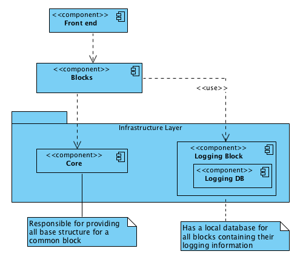
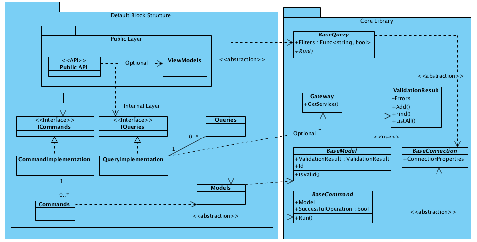
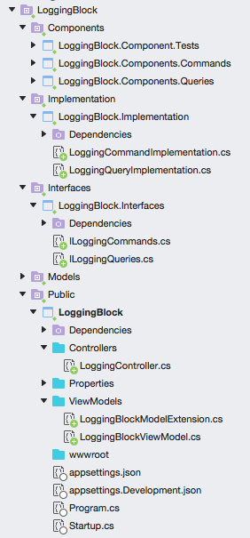
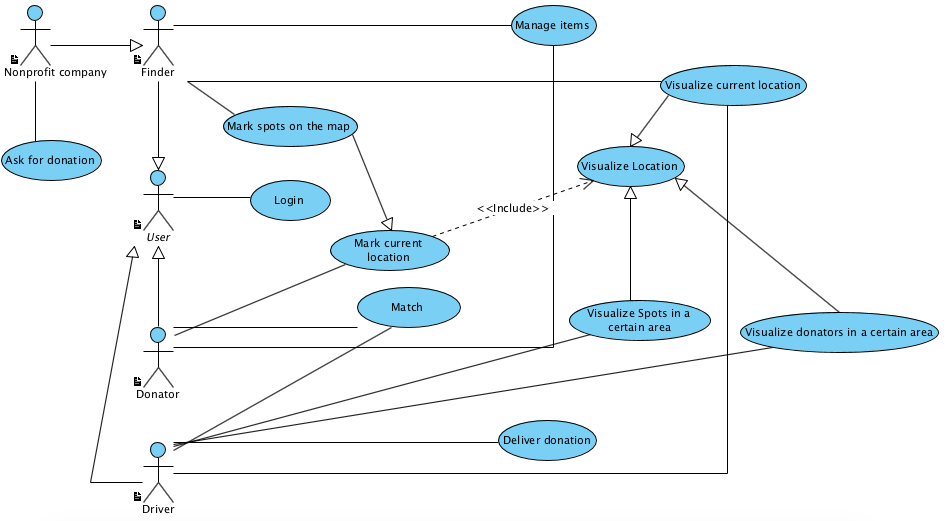

# Dharma Project

Project for software engineering study purposes. The goal of this project is to develop an application for charity purposes through matches between people who wants to donate something but do not know to whom to donate and people who can go to deliver these donations. The project is in constant change and open to new ideas, both on features and technologies.

## General idea and functional context

There is 3 sorts of actors that interacts with the system:

| Actor | Description |
| ----- | ----------- |
| Donator | User that  provides and catalogs items to be donated |
| Finder | Responsible for finding spots on the map to be shared among all the other users. Has high interaction with maps, location, gps, etc. In a practical way this profile mark points on the map that needs some kind of help, such as foods, clothes, etc. |
| Driver | Responsible for finding people who wants to donate something and cannot go to a needed place and necessity spots on the map |

The global software idea is to provide a way to connects these three sorts of users and help people or organizations that are in need.

## Global design

The project uses service oriented architecture approach. For that, each entity is managed by a service called `block`. To serve these blocks, there is a *core library* that abstracts interaction between blocks, logging / tracing information and also provides the interfaces to be implemented by blocks in order to make blocks follow same pattern. Below is a diagram that show a general idea of the project architecture:

## Technologies

The project is designed to use distributed architecture with following tools, patterns and technologies:

### Persistence
- Mongodb
### Backend
- .NET Core 2.1
- WEB API
- CQRS
- Microservices approach
- AutoFac for Dependency Injection
- Mongodb Driver

**This project does not uses in this moment some technologies normally related to `CQRS`, such as `Command Handler`, `Event Sourcing` and `Message Queue`*

### Front end
- Xamarin
- Angular

### Software architecture and modeling
- To orchestrate all blocks: Docker
- For UML diagrams: Visual Paradigm Community
- To describe features: Gherkin (this project uses BDD)
- To connect contributors: Slack (*to be created if needed)*

## Default block structure

Below is a diagram explaining the default structure and dependencies of a block and how it relates to Core library. To know more about each component of Core library see this specific readme.md file

### Explaining block components:

| Component | Is | Visibility | Depends | Explanation |
| --------- | -- | ---------- | -------- | ----------- |
| Public API | WEB API | Public | | Public API to be used for any other block |
| ViewModels | Class | Public | | Classes that contains the structure to communicate between block and external world. This level also has Extension methods to map `ViewModels` and internal `Models` and vice-versa |
| ICommands | Interface | Internal | | List of all possible commands (writing operations) to be implemented for the block |
| IQueries | Interface | Internal | | List of all possible queries (reading operations) to be implemented for hte block |
| CommandImplementation | Class | Internal | `ICommands` | Implementation of all commands provided by the block. To do so, it uses `Commands` component |
| QueryImplementation | Class | Internal | `IQueries`, `Gateway` | Implementation of all queries provided by the block. To do so, it uses `Queries` component. The dependency of `Gateway` core component is optional and is to connect to other block, if needed |
| Commands | Class | Internal | `BaseCommand`, `Models` | Implementation of a single command. This project has its own persistence connection for writing its information. For this moment the reading and writing information are the same, but the structure is prepared for future refactorings |
| Queries | Class | Internal | `BaseQuery`, `Models` | Implementation of a single query. This project has its own query connection. For this moment the reading and writing information are the same, but the structure is prepared for future refactorings. |
| Models | Class | Internal | `BaseModel` | Model classes to be used in the block | 
| Component.Tests | Class | Public | | Unit Tests component in same level of commands and queries. |
| Tests | Class | Public | | Acceptance Tests using *`Gherkin`* to validate the behavior of the system through all layers. This tests contains all expected features of the block |   

### Visual Studio folder structure:
Example of a folder structure using VS 2017 for MAC

### Phisical folder structure:

Follow same structure of `LoggingBlock`

## Use Cases

Below are the use cases mapped until now to develop the application

## Coding Standards and Naming Conventions

See (Recommended): https://www.dofactory.com/reference/csharp-coding-standards

## Contributing

Yeeey! :) If you want to contribute to this project follow these steps:

- Fork the main project on my Github
- Choose one feature already described
- Implement the acceptance and unit tests
- Create a pull request informing the percentage of test coverage of your code

*In order to avoid more than one person develop same feature, feel free to raise your hand and inform what you are developing*

## Licence

MIT
